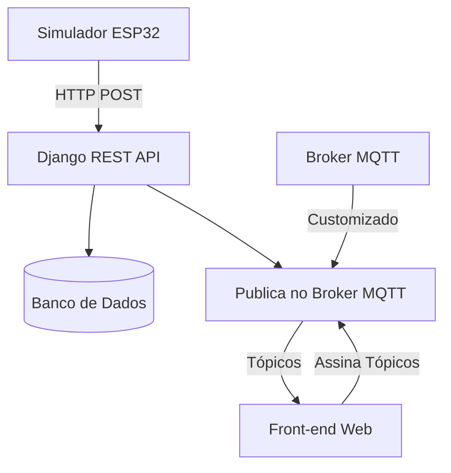

# Django MQTT IoT Dashboard

Este projeto demonstra uma plataforma IoT simples para monitoramento de sensores em tempo real. A arquitetura utiliza Django para o backend e API, um simulador de dispositivo ESP32 em Python, e um broker MQTT customizado para a comunicação em tempo real com um dashboard web.

## Arquitetura do Projeto

O fluxo de dados segue os seguintes passos:

1.  **Simulador ESP32**: Envia dados de temperatura e umidade via `HTTP POST` para a API do Django.
2.  **API Django (REST Framework)**:
    *   Recebe os dados do sensor.
    *   Salva os dados em um banco de dados SQLite.
    *   Publica os mesmos dados em um tópico MQTT.
3.  **Broker MQTT Customizado**:
    *   Recebe a publicação do Django.
    *   Distribui a mensagem para todos os clientes inscritos no tópico correspondente.
4.  **Dashboard Web**:
    *   Ao carregar, exibe a última leitura registrada no banco de dados (via view do Django).
    *   Tenta se conectar ao broker MQTT via JavaScript para receber atualizações em tempo real.

## Fluxo do Sistema



## Observações sobre o Funcionamento Atual

Conforme descrito pelo autor, o projeto tem uma particularidade em seu estado atual:

*   **O Broker customizado não suporta WebSockets**: O broker (`simple_broker.py`) implementa MQTT sobre TCP. Clientes em navegadores, como o usado no dashboard, precisam de uma conexão via WebSockets para funcionar.
*   **Atualização de Dados**: Como resultado, o script JavaScript no dashboard não consegue se conectar ao broker para receber as atualizações em tempo real. A seção "Última Leitura" é a que efetivamente se atualiza, mas apenas quando a página é **recarregada manualmente**, pois a view do Django busca o dado mais recente do banco a cada nova requisição.

Para habilitar a funcionalidade de tempo real, seria necessário adaptar o broker para suportar WebSockets ou utilizar um broker padrão (como Mosquitto) com essa funcionalidade ativada.

## Estrutura do Projeto

```
.
├── broker_mqtt/
│   └── simple_broker.py      # O broker MQTT customizado.
├── django_backend/
│   ├── api_app/              # App Django para a API REST.
│   ├── frontend_app/         # App Django para o dashboard.
│   └── manage.py             # Utilitário de gerenciamento do Django.
├── esp32_simulator/
│   └── simulador_esp32.py    # Script que simula o sensor.
└── requirements.txt          # Dependências do projeto.
```

## Como Executar

### 1. Pré-requisitos

*   Python 3.8+
*   Git

### 2. Instalação

Clone o repositório e instale as dependências:

```bash
git clone https://github.com/matheus-cortejas/Django-MQTT-Test
cd Django-MQTT-Test
pip install -r requirements.txt
```

### 3. Migrações do Banco de Dados

Navegue até a pasta do backend e aplique as migrações para criar o banco de dados.

```bash
cd django_backend
python manage.py migrate
```

### 4. Execução

Você precisará de **3 terminais** abertos para rodar todos os componentes do sistema.

**Terminal 1: Iniciar o Broker MQTT**

```bash
python broker_mqtt/simple_broker.py
```
*Saída esperada: `Broker MQTT customizado rodando em localhost:1883`*

**Terminal 2: Iniciar o Servidor Django**

```bash
# Certifique-se de estar na pasta django_backend/
python manage.py runserver
```
*Saída esperada: `Starting development server at http://127.0.0.1:8000/`*

**Terminal 3: Iniciar o Simulador ESP32**

```bash
python esp32_simulator/simulador_esp32.py
```
*O simulador irá pedir para você inserir os valores de temperatura e umidade.*

### 5. Visualização

1.  Abra seu navegador e acesse o dashboard: `http://localhost:8000/dashboard/`
2.  No terminal do simulador, envie novos dados de temperatura e umidade.
3.  **Recarregue a página** para ver a seção "Última Leitura" ser atualizada com os novos dados.